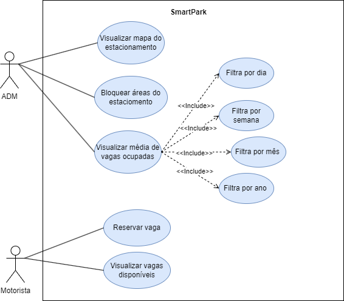
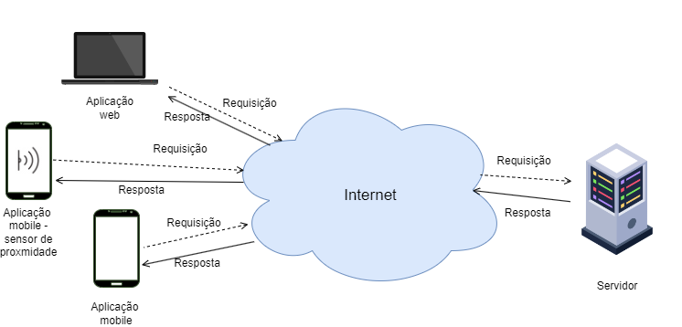

# SmartPark

Projeto final das disciplinas de Padrões de Arquitetura de Software e Software para Computação Ubíqua  
Drive: [link](https://drive.google.com/drive/u/1/folders/1oeRHFLwK7X5eI4soyAKVhkeMn246VeLP)

## Discentes:
- Bruna do Espirito Santo Sousa
- Layane Grazielle Souza Dias
- Pedro Ivo Santana Melo

## Sobre o Projeto

- **Objetivo:**    
  SmartPark é um estacionamento inteligente, que visa facilitar a busca por vagas do estacionamento, economizando tempo e reduzindo o tráfego desnecessário.   
  
- **Possíveis Funcionamentos:**    
**Sensorização das Vagas:** Cada vaga de estacionamento é equipada com sensores que detectam a presença de um veículo.   
**Atualização em Tempo Real:** Os sensores enviam dados em tempo real para a rede central, atualizando os gêmeos digitais das vagas de estacionamento.   
**Consulta via Aplicativo:** Usuários consultam o aplicativo para encontrar vagas disponíveis nas proximidades, recebendo informações atualizadas instantaneamente.   
**Reserva de Vagas:** O aplicativo pode permitir que os usuários reservem temporariamente uma vaga específica, garantindo sua disponibilidade quando chegarem ao local.   
**Navegação Assistida:** O aplicativo fornece direções passo a passo para a vaga escolhida, otimizando a rota com base na disponibilidade em tempo real.   

- **Benefícios:**    
**Economia de Tempo:** Motoristas economizam tempo ao encontrar vagas rapidamente, reduzindo o congestionamento nas áreas urbanas.   
**Redução de Emissões:** Menos tempo procurando estacionamento resulta em menos emissões de poluentes, contribuindo para um ambiente mais limpo.   
**Melhoria na Experiência do Usuário:** Os usuários têm uma experiência de estacionamento mais eficiente e conveniente, utilizando a tecnologia para facilitar suas atividades diárias.   
**Otimização do Uso do Espaço:** O sistema contribui para uma melhor utilização do espaço disponível, evitando vagas desnecessariamente ocupadas.   

## Diagrama Casos de uso

## Diagrama Arquitetura 

## Apresentação/Slides
Link dos slides usados durante a apresentação final do dia 02/02/2024:
[link](https://www.canva.com/design/DAF7lY8XSBU/zlPXj0Pnw37ocu4_0wlH5w/edit?utm_content=DAF7lY8XSBU&utm_campaign=designshare&utm_medium=link2&utm_source=sharebutton)
## Aplicação mobile
Devido o tamanho não era possivel deixar nesse repositório, os 2 app se encontram nesse link, app com mapa de vagas e app para acesso ao sensor do smartphone: [link](https://drive.google.com/drive/folders/1VCRIYNhtO1mrKKiv0-260kAjX08XAHDt?usp=sharing). Os APKs também estão na mesma pasta.
